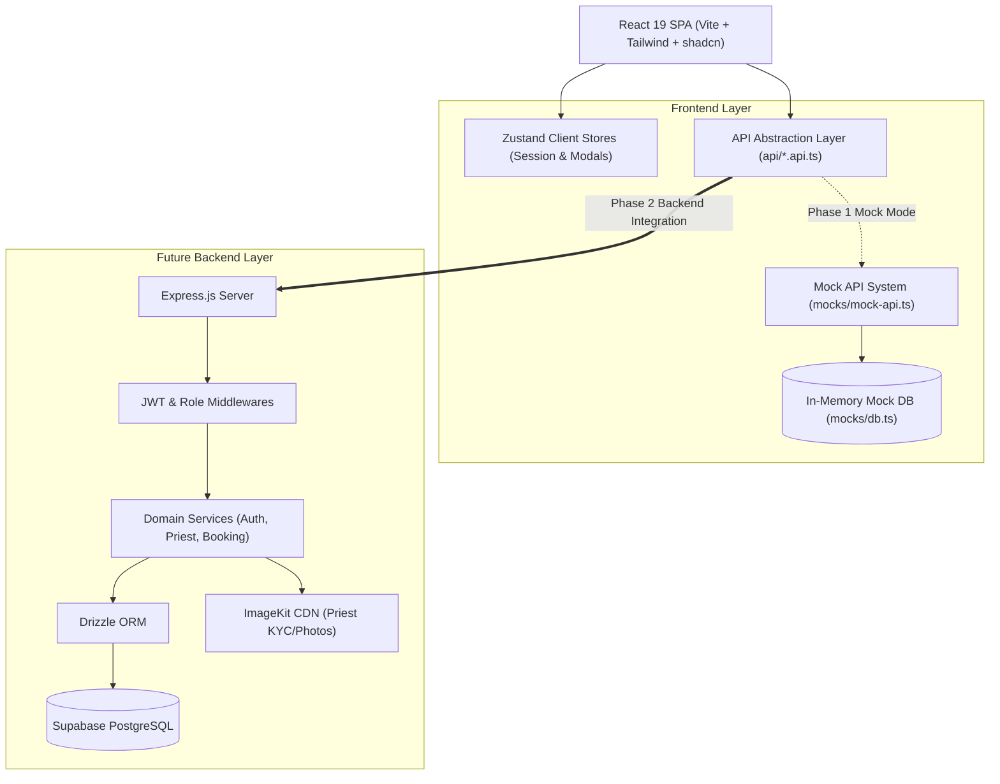

# System Architecture Overview - PujaCircle 🕉️

## 1. High-Level Architecture

PujaCircle is designed with a decoupled, modern web architecture. During Phase 1 scaffolding, the frontend operates completely independently using an in-memory Mock Database and API abstraction layer. In future backend integration, the API abstraction points to Express, Drizzle ORM, and Supabase PostgreSQL.

---

## 2. Layer Responsibilities

1. **Frontend UI Layer (`frontend/src/pages/`, `frontend/src/components/`)**:
   - Manages rendering, route navigation, and modal dialogues.
   - Strictly consumes `api/*.api.ts`.
   - Never accesses backend database or mock DB directly.
2. **State & Validation Layer (`frontend/src/store/`, `frontend/src/schemas/`)**:
   - `Zustand` manages transient client session and UI modal states.
   - `Zod` provides single-source-of-truth validation schemas across forms.
3. **API Layer (`frontend/src/api/`)**:
   - Provides clean asynchronous function interfaces.
   - In Phase 1: delegates to `mock-api.ts` with artificial delay.
   - In Phase 2: delegates to `AxiosClient` targeting `/api/v1/*`.
4. **Backend Placeholder (`backend/src/`)**:
   - Architectural routes, controllers, middleware, and database schema types structured for clean, incremental development.
