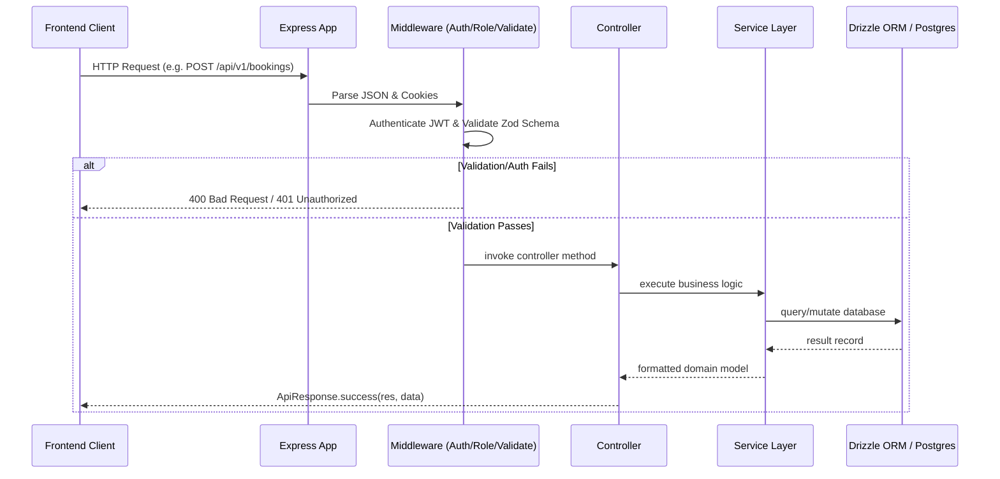

# Backend Architecture Specification - PujaCircle

## 1. Directory Organization

```
backend/src/
├── config/       # Environment & Database client configuration
├── controllers/  # Request handlers (input parsing, calling services, HTTP responses)
├── db/           # Drizzle ORM setup & schema definitions
│   └── schema/   # Table definitions (users, priests, rituals, addresses, slots, bookings)
├── middlewares/  # Express middlewares (auth, role authorization, validation, error handling)
├── routes/       # Express Router mappings per domain
├── services/     # Core business logic layer (auth, priest, booking, address, otp)
├── types/        # TypeScript declarations (express.d.ts)
├── utils/        # Shared helpers (api-response, custom errors, logger, cookies)
├── validations/  # Zod validation schemas for request bodies/queries
├── app.ts        # Express app factory with middleware mounting
└── server.ts     # HTTP server bootstrap entrypoint
```

---

## 2. Request Lifecycle Pipeline



---

## 3. Security Architecture

- **HTTP-Only Cookies**: JWT authentication tokens are stored in secure, SameSite HTTP-only cookies to eliminate XSS token theft.
- **Helmet**: Secures HTTP response headers.
- **Role-Based Access Control**: `USER`, `PRIEST`, and `ADMIN` roles enforced at route level via `authorizeRoles(...)`.
- **Validation**: Strict Zod schema parsing on all incoming payloads before reaching controllers.
