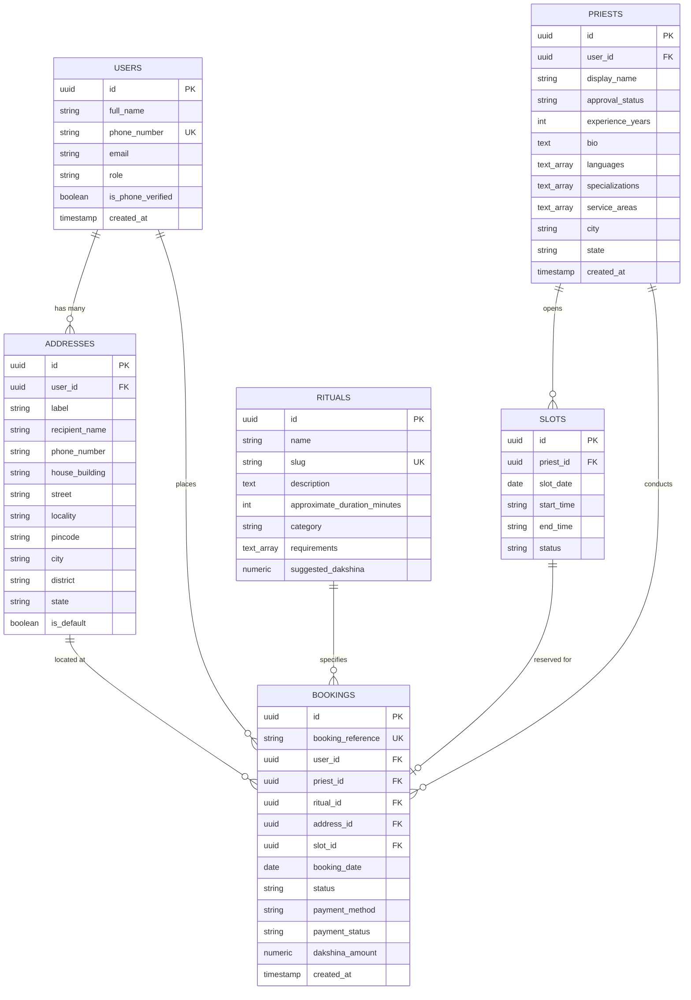

# Database Architecture Specification - PujaCircle

## 1. Technology Selection

- **Database Engine**: PostgreSQL (Hosted on Supabase).
- **ORM**: Drizzle ORM (Type-safe SQL dialect with zero overhead and full TypeScript inference).
- **Migration Engine**: Drizzle Kit (`drizzle-kit generate` & `drizzle-kit migrate`).

---

## 2. Relational Schema Architecture

