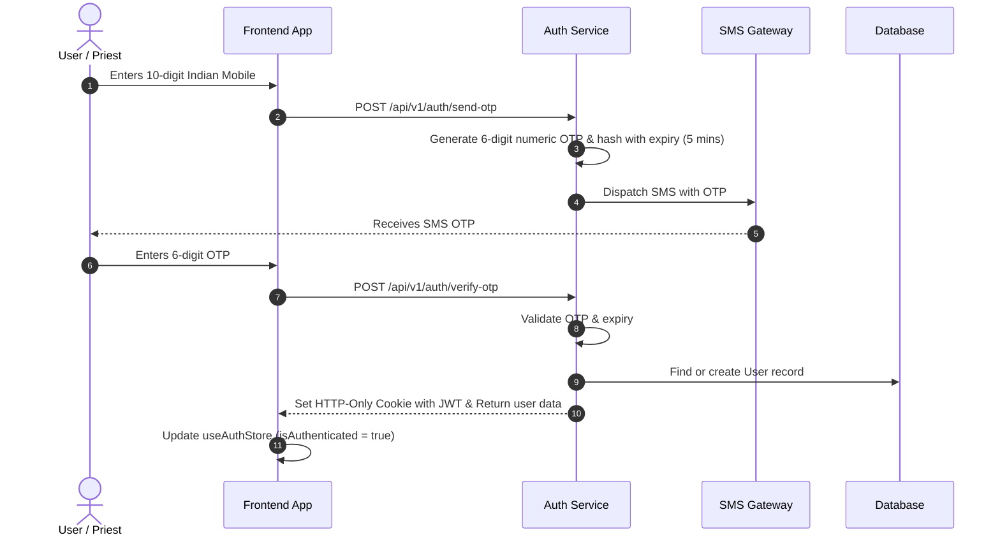

# Authentication Architecture & Flow - PujaCircle

## 1. Authentication Strategy

PujaCircle relies on **Phone Number + OTP** authentication natively designed for the Indian market (+91 mobile format).

### Key Architectural Principles:
1. **Passwordless by Default**: Users log in using OTP verification sent via SMS gateway.
2. **Abstracted OTP Provider**: The backend integrates via `otp.service.ts` to prevent coupling with any single vendor.
3. **Session Persistence**: JWT token stored inside an `HttpOnly`, `Secure`, `SameSite=Lax/Strict` cookie.

---

## 2. Authentication Lifecycle

