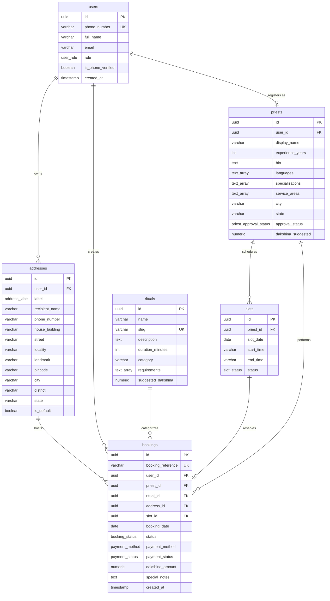

# Entity Relationship Diagram (ERD) - PujaCircle

```mermaid
erDiagram
    users ||--o{ addresses : "owns"
    users ||--o{ bookings : "creates"
    users ||--o| priests : "registers as"
    priests ||--o{ slots : "schedules"
    priests ||--o{ bookings : "performs"
    rituals ||--o{ bookings : "categorizes"
    addresses ||--o{ bookings : "hosts"
    slots ||--o| bookings : "reserves"

    users {
        uuid id PK
        varchar phone_number UK
        varchar full_name
        varchar email
        user_role role
        boolean is_phone_verified
        timestamp created_at
    }

    priests {
        uuid id PK
        uuid user_id FK
        varchar display_name
        int experience_years
        text bio
        text_array languages
        text_array specializations
        text_array service_areas
        varchar city
        varchar state
        priest_approval_status approval_status
        numeric dakshina_suggested
    }

    addresses {
        uuid id PK
        uuid user_id FK
        address_label label
        varchar recipient_name
        varchar phone_number
        varchar house_building
        varchar street
        varchar locality
        varchar landmark
        varchar pincode
        varchar city
        varchar district
        varchar state
        boolean is_default
    }

    rituals {
        uuid id PK
        varchar name
        varchar slug UK
        text description
        int duration_minutes
        varchar category
        text_array requirements
        numeric suggested_dakshina
    }

    slots {
        uuid id PK
        uuid priest_id FK
        date slot_date
        varchar start_time
        varchar end_time
        slot_status status
    }

    bookings {
        uuid id PK
        varchar booking_reference UK
        uuid user_id FK
        uuid priest_id FK
        uuid ritual_id FK
        uuid address_id FK
        uuid slot_id FK
        date booking_date
        booking_status status
        payment_method payment_method
        payment_status payment_status
        numeric dakshina_amount
        text special_notes
        timestamp created_at
    }
```
