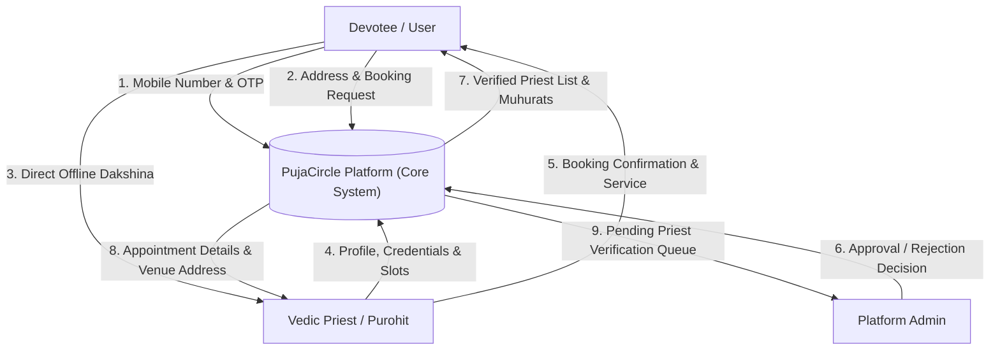

# Data Flow Diagrams (DFD) - PujaCircle 🕉️

## 1. DFD Level 0 (Context Diagram)



---

## 2. DFD Level 1 (Decomposition Diagram)

```mermaid
graph TD
    User([Devotee])
    Priest([Priest])
    Admin([Admin])
    
    P1["1.0 Authentication & Session Management"]
    P2["2.0 Address & Venue Management"]
    P3["3.0 Priest Discovery & Slot Engine"]
    P4["4.0 Booking & Scheduling Engine"]
    P5["5.0 Priest Onboarding & Admin Verification"]
    
    D1[("Users Store / DB")]
    D2[("Addresses Store / DB")]
    D3[("Priests & Slots DB")]
    D4[("Bookings DB")]
    
    %% Auth Flows
    User -->|Mobile & OTP| P1
    Priest -->|Mobile & OTP| P1
    P1 <-->|Read / Write User Auth| D1
    
    %% Address Flows
    User -->|Manage Addresses & PIN| P2
    P2 <-->|Store / Retrieve Addresses| D2
    
    %% Discovery & Slots
    User -->|Search by City/Language/Ritual| P3
    Priest -->|Publish Muhurat Slots| P3
    P3 <-->|Query Priests & Slots| D3
    
    %% Booking Engine
    User -->|Create Booking with Slot & Address| P4
    P4 -->|Mark Slot as BOOKED| D3
    P4 -->|Record Booking (Offline Cash)| D4
    D2 -->|Fetch Venue Details| P4
    
    %% Priest Onboarding & Admin
    Priest -->|Submit Bio & Vedic Lineage| P5
    Admin -->|Review & Approve/Reject| P5
    P5 <-->|Update Approval Status| D3
```
