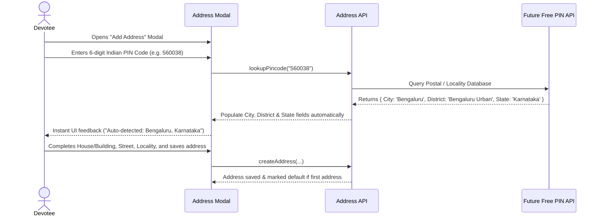

# Address Management Flow - PujaCircle

## 1. PIN-Code Auto-Detection Workflow

```mermaid
sequenceDiagram
    actor Devotee
    participant UI as Address Modal
    participant API as Address API
    participant Lookup as Future Free PIN API

    Devotee->>UI: Opens "Add Address" Modal
    Devotee->>UI: Enters 6-digit Indian PIN Code (e.g. 560038)
    UI->>API: lookupPincode("560038")
    API->>Lookup: Query Postal / Locality Database
    Lookup-->>API: Returns { City: 'Bengaluru', District: 'Bengaluru Urban', State: 'Karnataka' }
    API-->>UI: Populate City, District & State fields automatically
    UI-->>Devotee: Instant UI feedback ("Auto-detected: Bengaluru, Karnataka")
    Devotee->>UI: Completes House/Building, Street, Locality, and saves address
    UI->>API: createAddress(...)
    API-->>UI: Address saved & marked default if first address
```
