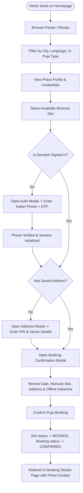
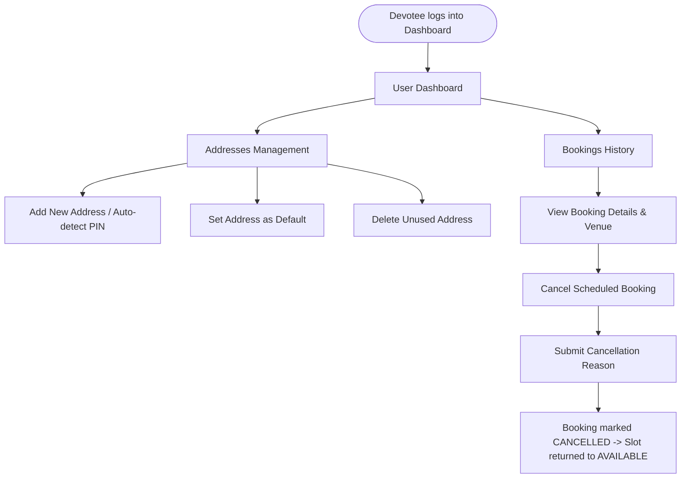

# Complete Application Flow Diagrams - PujaCircle 🕉️

## 1. Visitor & Devotee Booking Journey



---

## 2. Priest Onboarding & Admin Verification Flow

```mermaid
graph TD
    PStart([Priest visits Priest Portal]) --> PRegister[Fills Registration: Experience, Languages, Lineage]
    PRegister --> POTP[Verifies Mobile via 6-digit OTP]
    POTP --> PPending[Account Status -> PENDING]
    
    PPending --> AdminQueue[Appears in Admin Verification Queue]
    AdminQueue --> AdminReview[Admin inspects credentials & Vedic background]
    
    AdminReview --> AdminDecision{Admin Decision}
    AdminDecision -- Reject --> PRejected[Status -> REJECTED (Notification sent)]
    AdminDecision -- Approve --> PApproved[Status -> APPROVED]
    
    PApproved --> PDashboard[Priest Dashboard Activated]
    PDashboard --> AddSlots[Priest creates Muhurat Availability Slots]
    AddSlots --> PublicVisible[Priest & Slots become visible in public search]
```

---

## 3. Devotee Profile, Address & Cancellation Management


