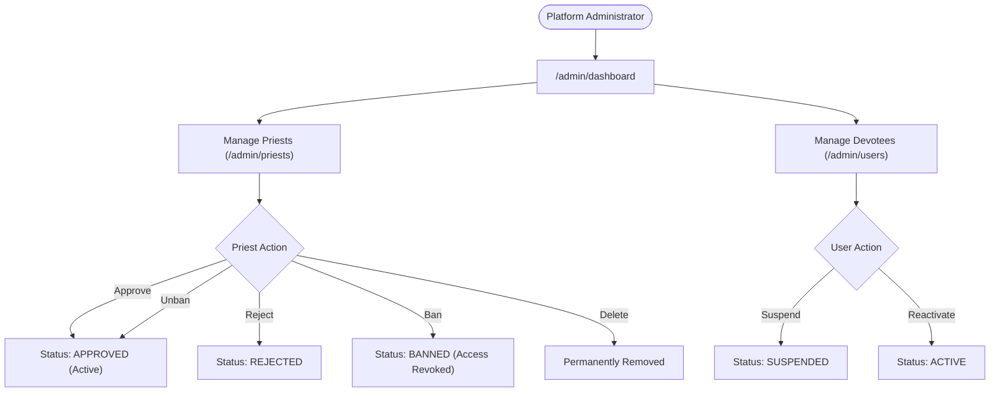
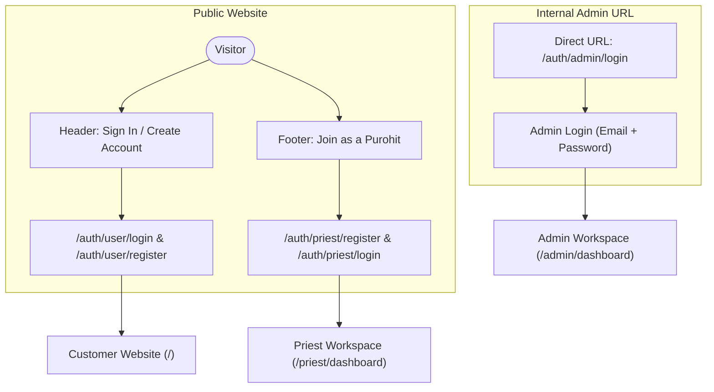

# Application Flow Diagrams - PujaCircle 🕉️

## 1. Unified Admin Management Lifecycle Flow

```mermaid
graph TD
    Admin([Platform Administrator]) --> AdminNav["/admin/dashboard"]
    
    AdminNav --> PriestMgmt["Manage Priests (/admin/priests)"]
    AdminNav --> UserMgmt["Manage Devotees (/admin/users)"]
    
    PriestMgmt --> PAction{Priest Action}
    PAction -- Approve --> P_Active["Status: APPROVED (Active)"]
    PAction -- Reject --> P_Rejected["Status: REJECTED"]
    PAction -- Ban --> P_Banned["Status: BANNED (Access Revoked)"]
    PAction -- Unban --> P_Active
    PAction -- Delete --> P_Deleted["Permanently Removed"]
    
    UserMgmt --> UAction{User Action}
    UAction -- Suspend --> U_Suspended["Status: SUSPENDED"]
    UAction -- Reactivate --> U_Active["Status: ACTIVE"]
```

---

## 2. Separate Authentication Architecture

```mermaid
graph TD
    subgraph Public Website
        Visitor([Visitor]) --> PublicNav[Header: Sign In / Create Account]
        PublicNav --> UserAuth["/auth/user/login & /auth/user/register"]
        Visitor --> FooterLink["Footer: Join as a Purohit"]
        FooterLink --> PriestAuth["/auth/priest/register & /auth/priest/login"]
    end

    subgraph Internal Admin URL
        AdminUrl["Direct URL: /auth/admin/login"] --> AdminAuth["Admin Login (Email + Password)"]
    end

    UserAuth --> UserDash["Customer Website (/)"]
    PriestAuth --> PriestDash["Priest Workspace (/priest/dashboard)"]
    AdminAuth --> AdminDash["Admin Workspace (/admin/dashboard)"]
```
