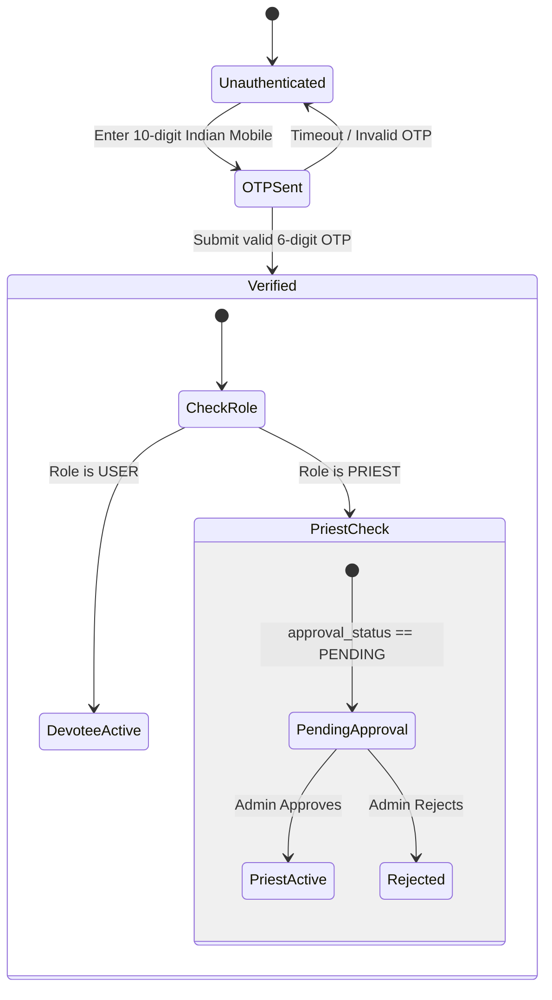

# Authentication Flow Diagrams - PujaCircle

## 1. User / Priest Registration & Login State Diagram

```mermaid
stateDiagram-v2
    [*] --> Unauthenticated
    Unauthenticated --> OTPSent : Enter 10-digit Indian Mobile
    OTPSent --> Verified : Submit valid 6-digit OTP
    OTPSent --> Unauthenticated : Timeout / Invalid OTP

    state Verified {
        [*] --> CheckRole
        CheckRole --> DevoteeActive : Role is USER
        CheckRole --> PriestCheck : Role is PRIEST
        
        state PriestCheck {
            [*] --> PendingApproval : approval_status == PENDING
            PendingApproval --> PriestActive : Admin Approves
            PendingApproval --> Rejected : Admin Rejects
        }
    }
```
