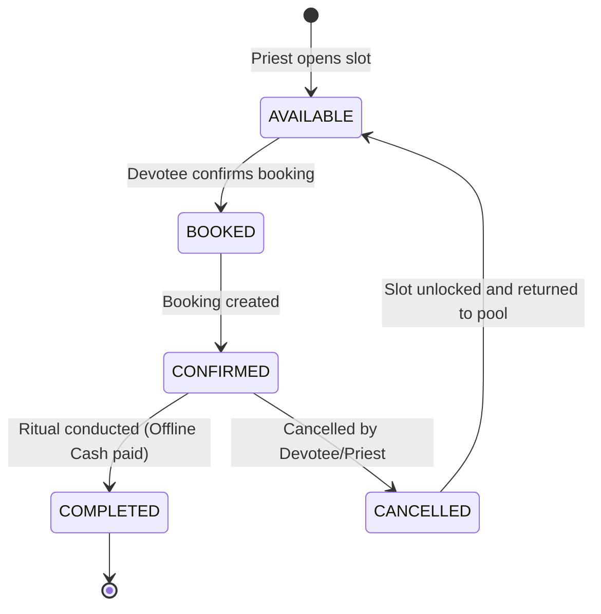
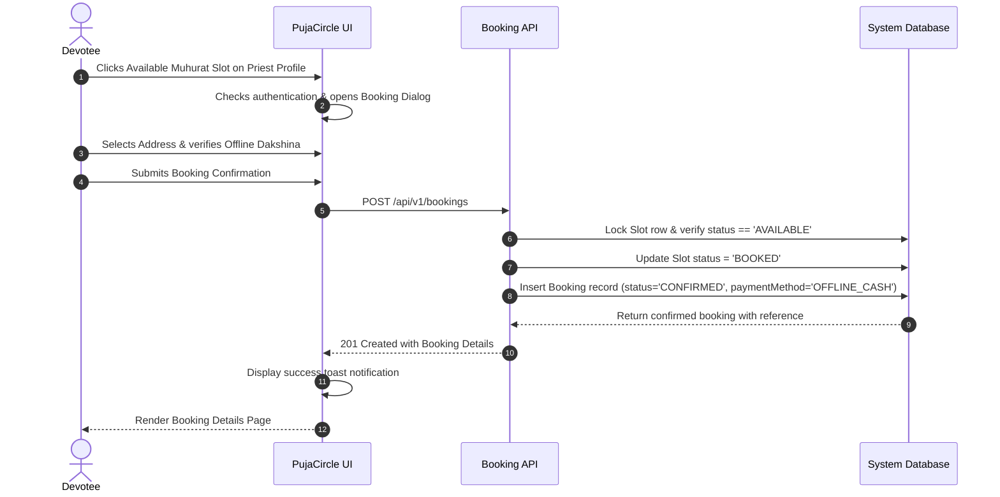

# Booking Lifecycle & Cancellation Flow - PujaCircle

## 1. Booking State Machine

```mermaid
stateDiagram-v2
    [*] --> AVAILABLE : Priest opens slot
    AVAILABLE --> BOOKED : Devotee confirms booking
    BOOKED --> CONFIRMED : Booking created
    CONFIRMED --> COMPLETED : Ritual conducted (Offline Cash paid)
    CONFIRMED --> CANCELLED : Cancelled by Devotee/Priest
    CANCELLED --> AVAILABLE : Slot unlocked and returned to pool
    COMPLETED --> [*]
```

---

## 2. Sequence Diagram: Booking Creation & Verification

```mermaid
sequenceDiagram
    autonumber
    actor Devotee
    participant App as PujaCircle UI
    participant API as Booking API
    participant DB as System Database

    Devotee->>App: Clicks Available Muhurat Slot on Priest Profile
    App->>App: Checks authentication & opens Booking Dialog
    Devotee->>App: Selects Address & verifies Offline Dakshina
    Devotee->>App: Submits Booking Confirmation
    App->>API: POST /api/v1/bookings
    API->>DB: Lock Slot row & verify status == 'AVAILABLE'
    API->>DB: Update Slot status = 'BOOKED'
    API->>DB: Insert Booking record (status='CONFIRMED', paymentMethod='OFFLINE_CASH')
    DB-->>API: Return confirmed booking with reference
    API-->>App: 201 Created with Booking Details
    App->>App: Display success toast notification
    App-->>Devotee: Render Booking Details Page
```
