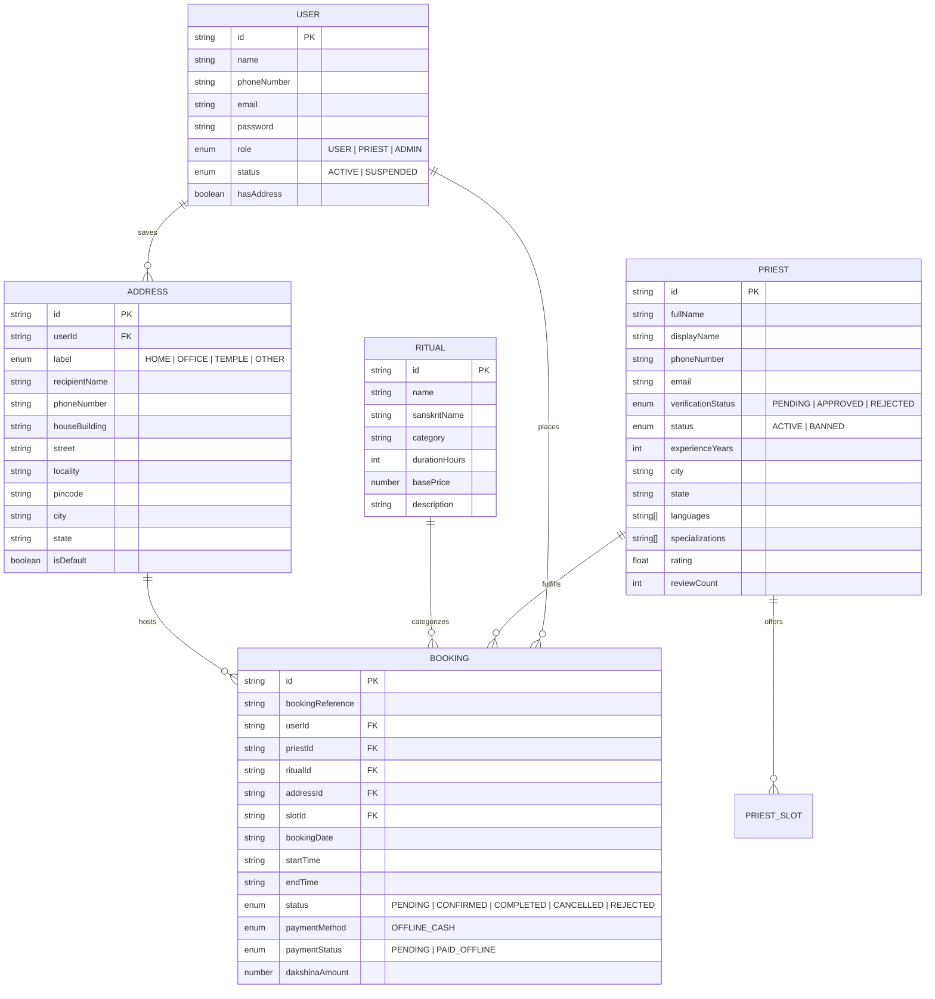

# PujaCircle Frontend — Comprehensive SRS & Architecture Blueprint

> **Document Version:** 1.0.0  
> **Target Audience:** Engineering Team, Product Mentors, UI/UX Contributors  
> **Status:** Phase 1 Complete (Mock-First Scaffolding, RBAC, Clean Modular Architecture, React 19)

---

## 1. Product Overview & Core Context

**PujaCircle** is a hyper-local devotional platform connecting Hindu devotees with verified Vedic Purohits (priests) for traditional religious rituals, ceremonies, and home pujas.

### 🎯 Key Product Goals
1. **Effortless Discovery**: Browse vetted Purohits based on city, Vedic lineage, languages spoken, rituals performed, and user reviews.
2. **Frictionless Ceremony Scheduling**: Multi-step booking wizard with calendar date and morning/afternoon/evening time-slot selection.
3. **PIN-Code Auto-Detection**: Hyper-local address management with instant Indian postal code resolution.
4. **Purohit Workspace**: Dedicated portal for priests to manage availability slots, review upcoming appointments, and approve/reject bookings.
5. **Admin Supervision Console**: Platform gatekeeping to approve priest KYC credentials, manage user statuses, and supervise bookings.

### 🚫 Strict Architectural Non-Goals (Out of Scope)
* ❌ **No Online Payments / Gateways**: PujaCircle uses purely offline Dakshina (`OFFLINE_CASH`) paid directly to the priest after ceremony completion.
* ❌ **No Live Real-Time Driver Tracking**: No GPS map tracking or live location streaming.
* ❌ **No E-Commerce Samagri Delivery**: Platform focus is strictly on priest discovery and scheduling.
* ❌ **No Native Mobile Frameworks**: Modern responsive Web App (desktop, tablet, mobile web).

---

## 2. Design System & UX Principles

### 🎨 Visual Identity & Color Palette
* **Primary (Devotional Saffron/Gold)**: Warm Vedic orange/saffron accents (`hsl(24 95% 53%)` / `#f97316`) symbolizing spiritual energy and ceremony fires.
* **Neutrals & Surfaces**: Clean stone/slate cards with subtle borders (`border-border/80`), gentle dark/light mode contrast, and soft elevations.
* **Typography**: Modern typography pairing an elegant serif font for headings and ritual titles with clean sans-serif for UI labels and tabular data.
* **Iconography**: Clean, consistent icons from `lucide-react`.

### 🧭 Modal-First & Guarded UX Pattern
* **Modal-First Creation**: Address creation, booking cancellations, and time-slot configurations open in focused modals (`AddressModal`, `CancelBookingDialog`, `TimeSlotModal`) to preserve user context.
* **Zero Layout Flickers**: Routes guarded by `ProtectedRoute`, `PublicRouteGuard`, and `GuestOnlyRoute` to prevent unauthorized flashes.
* **Graceful Suspense & Fallbacks**: Every page is code-split via `React.lazy()` with `<LoadingSpinner>` and wrapped in a root `<ErrorBoundary>`.

---

## 3. Tech Stack & Engineering Architecture

| Category | Technology | Description |
| :--- | :--- | :--- |
| **Framework** | **React 19** (`react@^19.0.0`, `react-dom@^19.0.0`) | Modern UI library with concurrent rendering |
| **Build Tool** | **Vite 6** (`vite@^6.0.7`, `@vitejs/plugin-react`) | High-speed ESM bundler with hot module replacement |
| **Language** | **TypeScript 5.7+** | Strict type safety across components, stores, and schemas |
| **Routing** | **React Router DOM 7** | Client-side routing with code-splitting and layout shells |
| **State Management** | **Zustand 5** (`zustand/middleware/persist`) | Lightweight global stores with automatic localStorage hydration |
| **Form & Validation** | **React Hook Form 7 + Zod 3** | Zero-tolerance strict schema validation (`.strict()`) |
| **UI Primitives** | **Radix UI + shadcn/ui** | Headless accessible components (Dialog, Dropdown, Tabs, etc.) |
| **Styling** | **Tailwind CSS v4** | Modern utility styling |
| **Notifications** | **Sonner** | Clean toast notifications for actions and errors |

---

## 4. File Structure & Component Hierarchy

```text
frontend/
├── public/                     # Static assets (favicons, manifest)
├── src/
│   ├── api/                    # API client & domain service endpoints
│   │   ├── client.ts           # Axios HTTP instance with sanitized error handling
│   │   ├── auth.api.ts         # Authentication endpoints (login, OTP, verify)
│   │   ├── user.api.ts         # Devotee profile and settings
│   │   ├── priest.api.ts       # Priest discovery, availability, and public listings
│   │   ├── booking.api.ts      # Booking creation, history, and cancellation
│   │   ├── address.api.ts      # Address CRUD & PIN code resolution
│   │   └── admin.api.ts        # Admin priest approvals & user management
│   │
│   ├── components/             # Reusable UI & Domain Components
│   │   ├── address/            # AddressModal, AddressCard, AddressList
│   │   ├── admin/              # AdminStatCard, PriestApprovalTable, UserManagementTable
│   │   ├── auth/               # AuthLoginForm, OtpVerificationCard, ForgotPasswordCard, ResetPasswordCard
│   │   ├── booking/            # BookingConfirmModal, BookingStatusBadge, UserBookingCard
│   │   ├── common/             # ErrorBoundary, ProtectedRoute, GuestOnlyRoute, LoadingSpinner, EmptyState
│   │   ├── layout/             # PublicLayout, PriestLayout, AdminLayout, Header, Footer
│   │   ├── priest/             # PriestCardSkeleton, PriestAvailabilitySlot, PriestBookingItem
│   │   └── ui/                 # Reusable shadcn/Radix primitives (Button, Input, Card, Dialog, etc.)
│   │
│   ├── lib/                    # Shared utilities & configurations
│   │   ├── config.ts           # Runtime environment configuration
│   │   ├── constants.ts        # System constants & enum labels
│   │   └── utils.ts            # Tailwind `cn()` helper & formatting utilities
│   │
│   ├── mocks/                  # Single Source of Truth Mock Engine
│   │   ├── db.ts               # In-memory database with realistic seed records
│   │   ├── delay.ts            # Network latency simulator (configurable)
│   │   ├── mock-api.ts         # Mock backend controller handlers & business logic
│   │   └── test-mock-api.ts    # CLI automated test suite (6 validation suites)
│   │
│   ├── pages/                  # Lightweight Page Orchestrators (Lazy Loaded)
│   │   ├── public/             # HomePage, AboutPage, ContactPage, RitualsPage, PriestListingPage, PriestDetailsPage
│   │   ├── auth/
│   │   │   ├── user/           # UserLoginPage, UserRegisterPage, UserVerifyPhonePage, UserForgotPasswordPage...
│   │   │   ├── priest/         # PriestLoginPage, PriestRegisterPage, PriestVerifyPhonePage, PriestForgotPasswordPage...
│   │   │   └── admin/          # AdminLoginPage (Private / hidden login portal)
│   │   ├── user/               # ProfilePage, AddressesPage, BookingsPage, BookingDetailsPage
│   │   ├── priest/             # PriestDashboardPage, PriestProfilePage, PriestAvailabilityPage, PriestBookingsPage
│   │   └── admin/              # AdminDashboardPage, AdminPriestsPage, AdminPriestDetailsPage, AdminUsersPage, AdminProfilePage
│   │
│   ├── routes/
│   │   └── app-router.tsx      # Central application router with React.lazy code splitting
│   │
│   ├── schemas/                # Zero-tolerance Zod input validation schemas (.strict())
│   │   ├── auth.schema.ts      # Login, OTP, registration, password recovery
│   │   ├── address.schema.ts   # 6-digit PIN, Indian phone, street, locality
│   │   ├── booking.schema.ts   # Booking creation, date bounds, cancellation
│   │   ├── priest.schema.ts    # Priest onboarding, bio length, experience bounds
│   │   └── user.schema.ts      # Devotee profile update schema
│   │
│   ├── store/                  # Zustand Global Stores
│   │   ├── auth.store.ts       # Auth session & user state (persisted in localStorage)
│   │   ├── address.store.ts    # Active address selector & address modal state
│   │   └── booking.store.ts    # Multi-step booking wizard draft state
│   │
│   └── types/                  # TypeScript interface contracts
│       ├── auth.types.ts
│       ├── address.types.ts
│       ├── booking.types.ts
│       ├── priest.types.ts
│       └── user.types.ts
```

---

## 5. Role-Based Access Control (RBAC) Matrix

| Route Path | Route Guard | `GUEST` | `USER` (Devotee) | `PRIEST` | `ADMIN` |
| :--- | :--- | :---: | :---: | :---: | :---: |
| `/` (Home, About, Contact) | `GuestOnlyRoute` | ✅ Allowed | 🔄 Redirects to `/rituals` | 🔄 Redirects to `/priest/dashboard` | 🔄 Redirects to `/admin/dashboard` |
| `/auth/user/*` | `GuestOnlyRoute` | ✅ Allowed | 🔄 Redirects to `/rituals` | 🔄 Redirects to `/priest/dashboard` | 🔄 Redirects to `/admin/dashboard` |
| `/auth/priest/*` | `GuestOnlyRoute` | ✅ Allowed | 🔄 Redirects to `/rituals` | 🔄 Redirects to `/priest/dashboard` | 🔄 Redirects to `/admin/dashboard` |
| `/auth/admin/login` | `GuestOnlyRoute` | ✅ Allowed | 🔄 Redirects to `/rituals` | 🔄 Redirects to `/priest/dashboard` | 🔄 Redirects to `/admin/dashboard` |
| `/rituals`, `/priests`, `/priests/:id` | `ProtectedRoute` | 🔒 Redirects to `/auth/user/login` | ✅ Allowed | 🚫 Blocked | 🚫 Blocked |
| `/profile`, `/addresses`, `/bookings` | `ProtectedRoute` | 🔒 Redirects to `/auth/user/login` | ✅ Allowed | 🚫 Blocked | 🚫 Blocked |
| `/priest/*` (Dashboard, Availability, Bookings) | `ProtectedRoute` | 🔒 Redirects to `/auth/priest/login` | 🚫 Blocked | ✅ Allowed | 🚫 Blocked |
| `/admin/*` (Dashboard, Priests, Users, Approvals) | `ProtectedRoute` | 🔒 Redirects to `/auth/admin/login` | 🚫 Blocked | 🚫 Blocked | ✅ Allowed |

---

## 6. Detailed Page Specifications & Mock Data Usage

### 6.1. Public & Marketing Pages

#### 1. `HomePage` (`/`)
* **Purpose**: Landing page introducing PujaCircle's mission, trusted Purohits, and popular Vedic ceremonies.
* **Target Audience**: Unauthenticated visitors & first-time devotees.
* **Components**: Hero section with search CTA, featured rituals carousel, trust badges, user testimonials.
* **Mock Data Used**:
  * `mockRituals`: Top featured rituals (Griha Pravesh, Satyanarayan Puja, Rudrabhishek).
  * Static marketing copy and benefits checklist.

#### 2. `AboutPage` (`/about`) & `ContactPage` (`/contact`)
* **Purpose**: Company mission, authenticity standards, support contact information.
* **Components**: Contact inquiry form, support details, office information.

---

### 6.2. Devotee Customer Workspace (`USER` Role)

#### 1. `RitualsPage` (`/rituals`)
* **Purpose**: Browse full catalog of Vedic rituals categorized by category (Home, Samskara, Deity, Occasion).
* **Interactions**: Search by name, filter by category/duration, click ritual to view available Purohits.
* **Mock Data Used**:
  * `mockRituals`: Array of `Ritual` objects (`id`, `name`, `sanskritName`, `category`, `durationHours`, `basePrice`, `samagriList`).

#### 2. `PriestListingPage` (`/priests`) & `PriestDetailsPage` (`/priests/:id`)
* **Purpose**: Search verified Purohits, view profile bio, Vedic lineage, specializations, customer ratings, and book appointments.
* **Interactions**: Filter by city, language, and ritual; click "Book Ceremony" to launch `BookingConfirmModal`.
* **Mock Data Used**:
  * `mockPriests`: Filtered to `verificationStatus === 'APPROVED'` and `status !== 'BANNED'`.
  * `mockSlots`: Priest available time slots by date.

#### 3. `AddressesPage` (`/addresses`)
* **Purpose**: Manage saved puja locations (Home, Office, Temple, Relative).
* **Interactions**: Add address modal with auto PIN code lookup, edit address, set default address, delete address.
* **Mock Data Used**:
  * `mockAddresses`: Array of `Address` records for the logged-in user.
  * `mockPincodeDirectory`: Map of 6-digit PIN codes to City, District, State, and postal localities.

#### 4. `BookingsPage` (`/bookings`) & `BookingDetailsPage` (`/bookings/:id`)
* **Purpose**: View devotee booking history categorized by tabs: Upcoming, Completed, Cancelled.
* **Interactions**: View booking details, download receipt summary, trigger cancellation dialog with mandatory reason.
* **Mock Data Used**:
  * `mockBookings`: Populated with `priest`, `ritual`, `address`, and `slot` objects.

---

### 6.3. Priest Dedicated Workspace (`PRIEST` Role)

#### 1. `PriestDashboardPage` (`/priest/dashboard`)
* **Purpose**: Priest control center displaying appointment statistics, today's schedule, and pending booking requests.
* **Interactions**: Quick-action buttons to accept or decline incoming devotee booking requests.
* **Mock Data Used**:
  * `mockBookings`: Filtered by `priestId === currentUser.id`.
  * Calculated stats: Total Completed Pujas, Pending Requests, Dakshina Earned.

#### 2. `PriestAvailabilityPage` (`/priest/availability`)
* **Purpose**: Calendar and slot manager for priests to declare working hours, morning/evening slots, or mark days off.
* **Interactions**: Toggle day availability, add custom time slots, set max bookings per day.
* **Mock Data Used**:
  * `mockSlots`: Array of `PriestSlot` records (`priestId`, `date`, `slotType`, `startTime`, `endTime`, `isBooked`).

#### 3. `PriestBookingsPage` (`/priest/bookings`)
* **Purpose**: Full operational log of priest appointments with status filters (`CONFIRMED`, `COMPLETED`, `CANCELLED`).
* **Interactions**: Mark booking as completed, view devotee address and special instructions.
* **Mock Data Used**:
  * `mockBookings` for the active priest.

---

### 6.4. Admin Portal Workspace (`ADMIN` Role)

#### 1. `AdminDashboardPage` (`/admin/dashboard`)
* **Purpose**: Platform-wide health overview displaying total devotees, registered priests, pending approvals, and booking volume.
* **Components**: `AdminStatCard` grid, monthly booking chart, recent activity feed.
* **Mock Data Used**:
  * `mockAdminStats`: System metrics (Total Users, Active Priests, Pending Verification, Total Ceremonies).
  * `mockAdminRecentActivities`: Audit trail log.

#### 2. `AdminPriestsPage` (`/admin/priests`) & `AdminPriestDetailsPage` (`/admin/priests/:id`)
* **Purpose**: Review incoming priest KYC applications, verify credentials, and approve, reject, or ban accounts.
* **Interactions**: Status filter tabs (All, Pending, Approved, Banned), search by priest name/phone, trigger approval or ban actions.
* **Mock Data Used**:
  * `mockPriests`: Complete dataset including `PENDING`, `APPROVED`, `REJECTED`, and `BANNED` records.

#### 3. `AdminUsersPage` (`/admin/users`)
* **Purpose**: Devotee management table showing registered users, cities, booking volume, and account state.
* **Interactions**: Search users, toggle account status (`ACTIVE` vs `SUSPENDED`).
* **Mock Data Used**:
  * `mockUsers`: Devotee list with account status, email, phone, and booking totals.

---

## 7. Central Mock Database Schema (`src/mocks/db.ts`)



---

## 8. Summary of Completed Hardening & Optimizations

1. **Strict Input Rejection**:
   * All Zod schemas enforce `.strict()` to reject unauthorized payload fields.
   * Explicit Indian phone regexes, 6-digit PIN code rules, and 6-digit numeric OTP validators.
2. **Security & Information Leakage Prevention**:
   * Root `ErrorBoundary` prevents display of raw React component traces.
   * Axios interceptor masks low-level network errors and connection refusals.
   * Server error middleware logs traces internally while returning generic sanitized messages for 500 status codes.
3. **DRY Auth Layer**:
   * Reduced 12 fragmented auth pages to reusable form cards (`AuthLoginForm`, `OtpVerificationCard`, `ForgotPasswordCard`, `ResetPasswordCard`).
4. **Performance & Lazy Loading**:
   * Core bundle size reduced by **~65%** via `React.lazy()` route chunking.
   * TypeScript build completes in **< 1.8s**.
